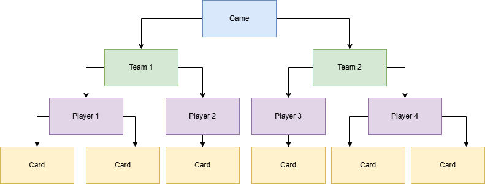

# Towards a generic model for card games

We are developing a generic model for defining arbitrary card games, including their rules and the cards themselves.

## Entities

Every part of the game state is an _entity_. Cards, players, teams, and even the game itself are examples of entities.

### Entity Attributes

Each entity can have a set of _attributes_ and values. The cost or power of a card, as well as the current life total of a player are great examples for attributes. Attribute values can have one of the following types:

* `Integer` (positive, negative, or zero)
* `Entity`
* `Entity List`

Conceptually, entities of a game can be organized as a _tree_ with parent-child relationships by using attributes of type `Entity` or `Entity List`:

Also, attributes of type `Entity` can be used to express temporary relationships, such as monsters that are about to fight each other. 

### Entity Tags

_Tags_ are used to describe the basic nature or current state of an entity. Examples are whether a card is a monster or a location, or whether a card has already been used this turn.

Tags can also be applied to other entities, such as the game state itself, for example to store the current turn phase.

Also, tags can be used for specifying the layer of an entity in the entity tree, e.g. if an entity is a player or card.

## Mutations

This very generic model allows for a very narrow, specific, yet highly impactful set of _mutations_.

Integer attribute mutations:

* `SetIntegerAttribute(entity, attribute, value)`

Entity attribute mutations:

* `SetEntityAttribute(entity, attribute, value)`

Entity list attribute mutations:

* `AddToTopOfEntityList(entity, attribute, entityToAdd)`
* `AddToBottomOfEntityList(entity, attribute, entityToAdd)`
* `RemoveFromTopOfEntityList(entity, attribute)`
* `RemoveFromBottomOfEntityList(entity, attribute)`
* `ShuffleEntityList(entity, attribute)`

Tag mutations:

* `AddTag(entity, tag)`
* `RemoveTag(entity, tag)`

These mutations are sufficient to change the state of any part of the game.

## Events

With this well-defined set of mutations, we can deduce a set of _events_ that can be used to trigger game rules or card abilities:

* `MatchStarted(entity)`
* `IntegerAttributeChanged(entity, attribute, oldValue, newValue)`
* `EntityAttributeChanged(entity, attribute, oldValue, newValue)`
* `EntityAddedToList(modifiedEntity, listAttribute, addedEntity)`
* `EntityRemovedFromList(modifiedEntity, listAttribute, removedEntity)`
* `TagAdded(entity, tag)`
* `TagRemoved(entity, tag)`

## Actions

_Actions_ are similar to functions or methods programming languages: They combine [mutations](#mutations) to powerful, re-usable building blocks that make up the game rules and things players can do.

An example would be an action `DrawCard`, which uses `RemoveFromTopOfEntityList` to remove the card from the top of the draw deck, and `AddToTopOfEntityList` to add that card to the hand of the player.

## Triggers

Putting it all together, you can use _triggers_ to define the rules of the game. Triggers listen for [events](#events) and execute [actions](#actions). 

Here is an example of a trigger called `DrawPhase`: Whenever the `TagAdded` event occurs, the trigger checks whether the tag is the `TurnPhase.Draw` tag. In that case, it executes a `DrawCard` action for the current player.

Another example would be a trigger called `PrepareMatch`, which listens for the `MatchStarted` event to make all players draw their initial hand of cards.

You might have noticed that the `MatchStarted` event providing an entity. That entity is the _match configuration_ which is automatically seeded with data that players specified before starting the match, such as their deck lists or the difficulty level.
